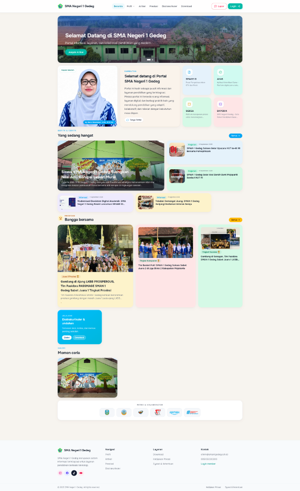
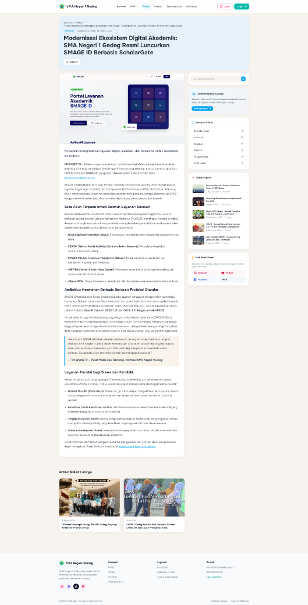
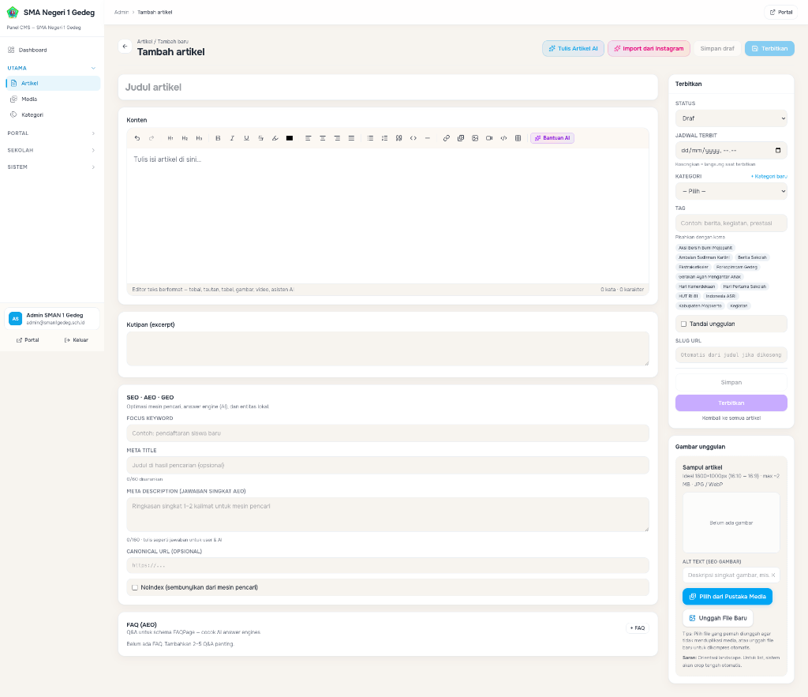
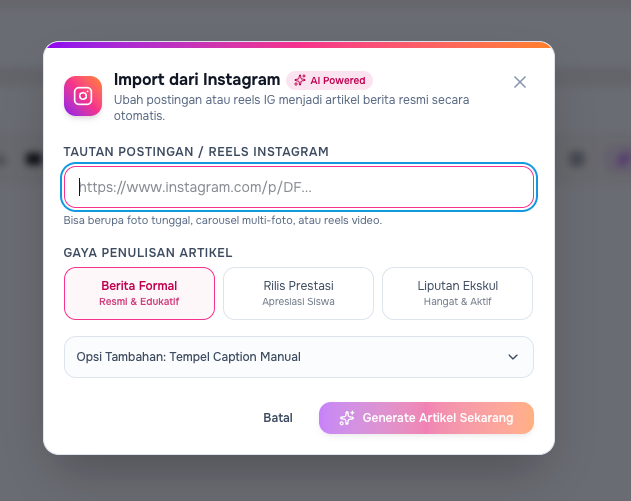

# CMS ScholarGate

<div align="center">

### Enterprise-Grade School Information Portal & Advanced AI CMS Engine

*A state-of-the-art, high-performance web platform for educational institutions built with Laravel 13, Inertia.js, React 19, TypeScript, Cloudflare R2 Storage, and Built-In Enterprise AI Intelligence.*

[](https://php.net)
[](https://laravel.com)
[](https://inertiajs.com)
[](https://reactjs.org)
[](https://typescriptlang.org)
[](https://tailwindcss.com)
[](https://openai.com)
[](https://cloudflare.com)
[-success?style=for-the-badge&logo=githubactions&logoColor=white)](https://github.com/Mango-Teknusa-Inovasi/CMS-ScholarGate/actions)
[](https://github.com/Mango-Teknusa-Inovasi/CMS-ScholarGate/wiki)
[](https://donate.ppti.me)

</div>

> [!TIP]
> 🇮🇩 **Documentation in Bahasa Indonesia**:  
> For comprehensive guides, AI Suite configuration, system architecture, plugin development, and deployment tutorials written in **Bahasa Indonesia**, please visit the official **[CMS ScholarGate GitHub Wiki](https://github.com/Mango-Teknusa-Inovasi/CMS-ScholarGate/wiki)**.

---

## 📋 Table of Contents

- [About ScholarGate](#-about-scholargate)
- [📸 Visual Showcase & Platform Tour](#-visual-showcase--platform-tour)
- [🤖 ScholarGate Intelligence Suite (Flagship Feature)](#-scholargate-intelligence-suite-flagship-feature)
  - [1. Universal RichText AI Copilot](#1-universal-richtext-ai-copilot-available-in-every-editor)
  - [2. Built-in Native Instagram Scraper & Auto-Journalism Engine](#2-built-in-native-instagram-scraper--auto-journalism-engine-zero-key-native-laravel)
  - [3. Media Library Reusability & Asset Management](#3-media-library-reusability--asset-management-wordpress-style)
  - [4. Specialized Institutional Content Generators](#4-specialized-institutional-content-generators)
  - [5. RAG School Assistant Chatbot & Hardened AI Security](#5-rag-school-assistant-chatbot--hardened-ai-security)
- [✨ Other Key Features](#-other-key-features)
- [🛠️ Technology Stack](#️-technology-stack)
- [🏗️ Architecture & Security Design](#️-architecture--security-design)
  - [🛡️ Engineering Standards: Anti-Slop & Security Skills Alignment](#️-engineering-standards-anti-slop--security-skills-alignment)
- [💻 System Requirements](#-system-requirements)
- [⚡ Getting Started](#-getting-started)
- [☁️ Cloud Storage & Dual Backups](#️-cloud-storage--dual-backups)
- [🔐 Authentication, Socialite OIDC & RBAC](#-authentication-socialite-oidc--rbac)
- [🧪 Testing & Quality Assurance](#-testing--quality-assurance)
- [🚀 Deployment & Production](#-deployment--production)
- [📦 Releases & Distribution](#-releases--distribution)
- [📚 Documentation Index](#-documentation-index)
- [💖 Support & Donation](#-support--donation)
- [📄 License](#-license)

---

## 📌 About ScholarGate

**ScholarGate** is an all-in-one digital experience platform built specifically for high schools, vocational institutions (SMK), and modern educational campuses. It unifies an engaging, responsive **Public Portal** for students, parents, and alumni with an **AI-powered Admin CMS** for educators and journalists.

Unlike traditional educational CMS solutions, ScholarGate operates as an **Inertia-driven Single-Page Application (SPA)** that combines Laravel backend reliability with React 19 micro-interactions. With **zero client layout shifts**, **sub-second page transitions**, and **embedded AI assistants**, ScholarGate streamlines school content creation from hours to minutes.

---

## 📸 Visual Showcase & Platform Tour

<div align="center">

### 🌟 Modern Public Portal & Dynamic Bento Board
*Responsive Bento Grid layout with 60fps micro-animations, principal's greeting, interactive digital services, active news, achievement carousels, and extracurricular directories.*



<br/><br/>

### 📰 Journalistic Reading Experience & Smart Sidebar
*Clean typography, reading time estimates, protected view counters, dynamic sidebar widgets (School Info, Trending Articles, File Downloads, Official Social Channels), and related story recommendations.*



<br/><br/>

### ✍️ Article Publishing Studio & TipTap AI Copilot
*Comprehensive newsroom studio featuring TipTap WYSIWYG editor, inline AI copilot, Media Library integration with cover selection, schedule publishing, inline taxonomy management, and full SEO/AEO/GEO metadata optimization with FAQ schema builders.*



<br/><br/>

### ⚡ AI-Powered Instagram Import & Auto-Journalism Studio
*Transform Instagram posts, multi-photo carousels, or Reels into complete, publication-ready journalistic articles with zero API keys required, automatic media optimization into WebP, and customized institutional tones.*



</div>

---

## 🤖 ScholarGate Intelligence Suite (Flagship Feature)

ScholarGate features an end-to-end, enterprise-grade AI engine deeply woven into every content creation surface of the CMS. It empowers administrators and teachers to write compelling, grammatically perfect, and SEO-optimized institutional content effortlessly.

```
┌─────────────────────────────────────────────────────────────────────────────────────────┐
│                              SCHOLARGATE AI INTELLIGENCE                                │
│                                                                                         │
│  ┌───────────────────────┐  ┌──────────────────────────────┐  ┌──────────────────────┐  │
│  │ Universal AI Copilot  │  │ Native Instagram Auto-Writer │  │ Specialized Gen AI   │  │
│  │ (Every HTML Editor)   │  │ (Zero-Key Laravel Scraper)   │  │ (Speeches, Profiles) │  │
│  └──────────┬────────────┘  └──────────────┬───────────────┘  └──────────┬───────────┘  │
│             │                              │                             │              │
│             ▼                              ▼                             ▼              │
│  ┌───────────────────────────────────────────────────────────────────────────────────┐  │
│  │ Security Shield: Prompt Injection Filter · Boundary Tags · Brand Persona Masking  │  │
│  └─────────────────────────────────────────┬─────────────────────────────────────────┘  │
│                                            │                                            │
│                                            ▼                                            │
│  ┌───────────────────────────────────────────────────────────────────────────────────┐  │
│  │ Providers: OpenAI (GPT-4o) · OpenRouter · DeepSeek · Groq · Custom Endpoints      │  │
│  └───────────────────────────────────────────────────────────────────────────────────┘  │
└─────────────────────────────────────────────────────────────────────────────────────────┘
```

### 1. Universal RichText AI Copilot (Available in Every Editor)
Every HTML text editor across the CMS (Articles, Speeches, Profiles, Achievements, Extracurriculars) is equipped with a **✨ Bantuan AI** copilot toolbar button:
- **Tulis Baru / Buat Draf**: Generates structured paragraphs from rough concepts or bullet points.
- **Perbaiki PUEBI & Tata Bahasa**: Corrects typos, punctuation, formal Indonesian vocabulary, and capitalization without altering original meaning.
- **Perluas & Detail**: Enriches short paragraphs into detailed, high-context institutional narratives.
- **Ringkas Teks**: Distills lengthy reports or articles into punchy summaries and bullet points.
- **Sesuaikan Nada (Tone Shift)**: Instantly transforms text into:
  - *Resmi & Formal*: Institutional and governmental tone.
  - *Inspiratif & Bangga*: Celebratory and uplifting tone celebrating students and teachers.
  - *Hangat & Mengayomi*: Empathetic and approachable tone for parent communications.
  - *Visioner & Edukatif*: Forward-looking academic vision and 21st-century educational innovation.

### 2. Built-in Native Instagram Scraper & Auto-Journalism Engine (Zero-Key, Native Laravel)
School activities are frequently posted first on Instagram. ScholarGate bridges social media and the official school portal seamlessly via an **autonomous, zero-key native Instagram scraper** integrated directly within Laravel:

- **Zero-Key & Unlimited Freedom**: Unlike standard solutions reliant on expensive third-party APIs with restrictive monthly quotas, ScholarGate's native scraper runs directly on your server without requiring RapidAPI keys or subscriptions.
- **4-Tier Intelligent Scraping Architecture**:
  1. **Tier 1 (Native Bot Emulation & SSR JSON)**: Emulates verified OpenGraph crawler user-agents (Meta External Hit, Twitterbot, TelegramBot, WhatsApp) to extract server-side rendered JSON payloads specifically matching the post's shortcode.
  2. **Tier 2 (Native Web API with Session Cookie)**: Emulates the Instagram Web API with customizable App IDs and optional session cookies to easily bypass rate limits and scrape institutional private feeds.
  3. **Tier 3 (RapidAPI Fallback)**: Automatically falls back to RapidAPI if configured in admin settings.
  4. **Tier 4 (Meta oEmbed Fallback)**: Public metadata fallback ensuring resilience.
- **Targeted Media Extraction**: Intelligently isolates media assets belonging strictly to the targeted post. Profil avatars, collaborator badges, and recommendation sidebars are strictly filtered out, capturing only single photos, multi-slide carousels, or Reels video thumbnails.
- **Automated WebP Conversion & Cloud Sync**: Downloaded Instagram media is automatically converted to modern WebP format, resized, and registered directly into the **Media Library** (or Cloudflare R2 object storage).
- **One-Click Journalistic Article Generation**:
  - Automatically expands social media captions into full journalistic school news articles.
  - Selectable writing presets: **Berita Formal (Resmi & Edukatif)**, **Rilis Prestasi (Apresiasi Siswa)**, or **Liputan Ekskul (Hangat & Aktif)**.
  - Generates news headlines, clean HTML bodies with subheadings, quotes, categories, tags, excerpts, and complete SEO/AEO metadata.
  - Includes a fallback drawer to manually paste captions if the Instagram URL is restricted.

### 3. Media Library Reusability & Asset Management (WordPress-Style)
Prevent server bloat and redundant uploads through ScholarGate's centralized **Media Library**:
- **Reuse Existing Assets ("Pilih dari Pustaka Media")**: Select previously uploaded covers, gallery photos, and school logos directly within the article and achievement editors with instant preview.
- **Direct Upload ("Unggah File Baru")**: Fast file uploader supporting auto WebP compression, aspect ratio validation (16:9 / 16:10 recommended), and client-side format checks.
- **Unified Media Registry**: Tracks file dimensions, mime types, file sizes, and storage locations (Local Disk or Cloudflare R2 CDN).

### 4. Specialized Institutional Content Generators
- **✨ Generator Berita dari Petunjuk Singkat**: In the article editor, input just an event topic and key points; the AI crafts the entire journalistic article: Title, URL Slug, Excerpt, Body (clean HTML with headings, lists, quotes), Category matching, Tags, Focus Keyword, and Meta Descriptions.
- **✨ Generator Sambutan Kepala Sekolah**: Crafts heartfelt and authoritative speeches for the Homepage and Profile page with configurable tone (*Hangat & Mengayomi*, *Visioner*, *Karakter Bangsa*, *Religius*).
- **✨ Generator Keterangan Profil Sekolah**: Generates comprehensive profile tabs (Sejarah, Visi Misi, Budaya Sekolah, Fasilitas Unggulan) formatted with clean semantic HTML.
- **✨ Generator Liputan Prestasi AI**: Generates complete championship news articles, medalist badges, and celebratory quotes from tournament metadata within the wide two-column achievement editor.

### 5. RAG School Assistant Chatbot & Hardened AI Security
- **Public AI Chatbot**: Visitors can ask questions about admissions (PPDB), school culture, curriculum, and extracurriculars, answered via Retrieval-Augmented Generation (RAG) referencing published school content.
- **Prompt Injection Defense**: Sanitizes all input using `filterPromptInjection` and encapsulates untrusted user input within boundary isolation tags (`<untrusted_material>`).
- **Brand Persona & Model Masking**: Protects proprietary setup by masking backend models behind a configurable institutional name (`custom_ai_model_name`).
- **Flexible Multi-Provider**: Compatible with standard OpenAI API endpoints, OpenRouter, 9Router, DeepSeek, and Groq.

---

## ✨ Other Key Features

### 🌐 Modern Public Portal
- **Bento Board Grid UI**: Responsive homepage grid with smooth 60fps micro-animations powered by Framer Motion.
- **Dynamic Lucide Icon Engine**: 80+ dynamic icons mapped to school programs, facilities, and extracurriculars.
- **Customizable Article Sidebar Widgets**: Dynamic widgets (Search, Categories, Popular Posts, Download Shortcuts, School Info) configurable by the administrator.
- **Member Area**: Dedicated student & alumnus portal with Gravatar avatars and profile management.
- **Institutional Branding**: Dynamic favicon generator, school emblem co-branding, and custom color accents.

### 🛡️ Enterprise Admin CMS & Settings Hub
- **TipTap WYSIWYG Newsroom Studio**: Advanced rich text editor with full formatting (headings, formatting, blockquotes, code, tables, YouTube video embeds, and AI copilot).
- **Wide Two-Column Achievement Editor**: Spacious newsroom canvas tailored for comprehensive championship coverage, award badges, and photo galleries.
- **Tabbed Settings Dashboard**: Clean, organized configuration tabs for *Umum*, *AI & RAG Intelligence*, *Social Login (OIDC)*, *Branding*, *SEO/AEO*, *Backup & Cloud*, and *Maintenance*.
- **WordPress-Style Plugin Architecture**: Extend functionality (e.g. PPDB Online, Digital Library) via modular `.ZIP` packages with action & filter hooks (`Hook::addFilter()`, `Hook::doAction()`).
- **Universal Socialite & OIDC Login**: Support for Google, GitHub, Authentik, Keycloak, and custom OpenID Connect providers with automatic RBAC synchronization.
- **Granular RBAC**: Role-based access control with live user search, status management, and upgrade/downgrade between `Admin`, `Editor`, and `Member`.

### 🔍 Advanced SEO, AEO & GEO Optimization
- **Dynamic Structured Data**: Automatic Open Graph tags, Twitter Cards, canonical links, and Schema.org JSON-LD.
- **Search & AI Engine Feeds**: Auto-generated `sitemap.xml`, `robots.txt`, `site.webmanifest`, and AI crawler index `llms.txt`.
- **Search Verification**: Built-in verification tokens for Google Search Console and Bing Webmaster Tools.

---

## 🛠️ Technology Stack

| Layer | Technology | Purpose |
| :--- | :--- | :--- |
| **Backend Framework** |  | PHP 8.2+ core with Sanctum API auth, Eloquent ORM, and queue pipelines |
| **Monolith Bridge** |  | Direct backend-to-React component state binding without REST boilerplate |
| **Frontend UI** |   | Type-safe React components with TanStack Query v5 data synchronization |
| **Styling & Motion** |   | Modern glassmorphic interface with hardware-accelerated animations |
| **AI Intelligence** |  | Universal RichText copilot, prompt article generator, and RAG chatbot |
| **Cloud Object Storage** |  | S3-compatible cloud storage for WebP media and off-site cloud backups |
| **Database** |   | PostgreSQL 14+ (Recommended), MySQL 8.0+, MariaDB 10.5+, or SQLite |
| **Asset Compiler** |  | Ultra-fast asset bundler producing zero-node production builds |

---

## 🏗️ Architecture & Security Design

ScholarGate follows a modular monolith architecture separating presentation, domain, and infrastructure:

```
┌─────────────────────────────────────────────────────────────┐
│  Presentation Layer                                         │
│  • React 19 + Inertia.js Single-Page Components             │
│  • Blade root template with dynamic SEO & JSON-LD metadata   │
│  • Universal RichTextEditor with AI Copilot toolbar         │
├─────────────────────────────────────────────────────────────┤
│  Application / HTTP Layer                                   │
│  • Web Controllers (Inertia PageController, Install, Update)│
│  • JSON API Controllers (/api/v1/* Admin, Public & AI)      │
│  • Auth Guards (Sanctum, Socialite OIDC, Admin & SuperAdmin)│
├─────────────────────────────────────────────────────────────┤
│  Domain & AI Service Layer                                  │
│  • OpenAiArticleService (Universal Copilot, Prompt Gen, RAG)│
│  • InstagramArticleImportService & InstagramScraperService  │
│  • BackupService (Dual Cloudflare R2 Sync & Portable JSON)  │
│  • SeoService & HtmlSanitizer (HTMLPurifier)                │
├─────────────────────────────────────────────────────────────┤
│  Infrastructure Layer                                       │
│  • Eloquent Models (Article, User, Achievement, Setting)    │
│  • Cloudflare R2 / S3 Storage Driver & Local Storage Fallback│
│  • PostgreSQL / MySQL / SQLite Database Drivers             │
└─────────────────────────────────────────────────────────────┘
```

### 🛡️ Engineering Standards: Anti-Slop & Security Skills Alignment

ScholarGate is engineered under strict code quality and security standards derived from open-source AI agent skill repositories:

- 🧹 **Anti-Slop Standard** — [miqdadbadjuber/anti-slop](https://github.com/miqdadbadjuber/anti-slop) (`antislop`, `antislop-code`, `antislop-ui`):
  - **No Code Slop**: Zero generic AI boilerplate comments, redundant fallback blocks, or unneeded transpilations. Clean, production-grade TypeScript & PHP.
  - **Premium UI & Motion Hygiene**: Hardware-accelerated CSS transitions, zero forced reflows, and vibrant glassmorphic Bento tiles.
  - **Human & Accessibility First (`antislop-human`, `antislop-layoutmobile`)**: Guaranteed WCAG 2.1 AA color contrast (> 4.5:1), responsive layout reflows across phone to desktop, semantic heading hierarchy (`h1 -> h2 -> h3`), and 36px+ touch target boxes.
  - **Copywriting Hygiene (`antislop-copywriting`)**: Natural, engaging institutional copy devoid of artificial AI writing patterns.

- 🔒 **Security Audit Standard** — [`security-audit`](./docs/SECURITY.md):
  - **Prompt Injection Boundary Shielding**: Input isolation using `filterPromptInjection` and `<untrusted_material>` XML boundaries for AI endpoints.
  - **XSS & HTML Sanitization**: HTMLPurifier backend filtering (`ezyang/htmlpurifier`) and DOMPurify frontend sanitization.
  - **Zero-Trust Access & RBAC**: Strict multi-guard authentication (Sanctum + OIDC Socialite), role-based middleware (`auth`, `admin`, `super_admin`), and model name masking (`custom_ai_model_name`).

---

## 💻 System Requirements

| Requirement | Specification |
| :--- | :--- |
| **PHP Version** | **PHP 8.2** or higher (Required extensions: `pdo`, `mbstring`, `openssl`, `tokenizer`, `json`, `fileinfo`, `gd`, `zip`, `curl`) |
| **Database Engine** | **PostgreSQL 14+** (Recommended) or **MySQL 8.0+** / **MariaDB 10.5+** / SQLite |
| **Package Manager** | Composer 2.x |
| **Node.js** | Node.js 20+ (Build-time only; not needed on production hosting) |
| **Object Storage (Optional)** | Cloudflare R2 (or AWS S3) for cloud media CDN and automatic off-site backups |
| **AI Provider (Optional)** | OpenAI API Key, OpenRouter, DeepSeek, or any OpenAI-compatible API endpoint |

---

## ⚡ Getting Started

### 1. Local Development Setup

```bash
# Clone the repository
git clone https://github.com/Mango-Teknusa-Inovasi/CMS-ScholarGate.git
cd CMS-ScholarGate

# Install backend dependencies
composer install

# Configure environment file
cp .env.example .env
php artisan key:generate

# Set up local database & seed sample data
touch database/database.sqlite
php artisan migrate --seed

# Install frontend dependencies & run build watcher
npm install --legacy-peer-deps
npm run dev

# In another terminal, start the Laravel backend server
php artisan serve
```

Access the portal at `http://127.0.0.1:8000`.

### 2. Default Development Credentials

| Role | Access URL | Default Email | Default Password |
| :--- | :--- | :--- | :--- |
| **Super Admin** | `/admin/login` | `admin@scholargate.test` | `Scholargate!Admin2026` |
| **Member** | `/login` | `member@scholargate.test` | `Scholargate!Member2026` |

---

## ☁️ Cloud Storage & Dual Backups

ScholarGate features a resilient **Dual Backup Engine**:

1. **Automatic Cloud Sync**: Every database backup created via `/admin/backups` produces a portable JSON snapshot and immediately uploads a replica to **Cloudflare R2 Object Storage** (`static-cdn-r2`).
2. **Redundancy & Failover**: Backups display status indicators (`☁️ Cloud + Server`, `☁️ Cloud R2`, `🖥️ Server Lokal`). In case of local disk loss, backups are seamlessly retrieved from Cloudflare R2.
3. **Flexible Restore Modes**:
   - **Merge (Content Only)**: Updates articles, achievements, downloads, and galleries without overwriting site contact settings or administrator accounts.
   - **Replace (Full Restore)**: Completely resets the database to the snapshot state.

---

## 🔐 Authentication, Socialite OIDC & RBAC

- **Multi-Provider Social Login**: Native support for **Google**, **GitHub**, **Authentik**, **Keycloak**, and custom OpenID Connect (OIDC) endpoints.
- **Granular Roles**:
  - `admin`: Full system access, settings, backups, user management, and AI configuration.
  - `editor`: Content publishing (Articles, Prestasi, Gallery, Downloads, Ekstrakurikuler).
  - `member`: Registered students, alumni, and parents accessing portal features.
- **Automatic Token Synchronization**: Unified token management bridging session-based Inertia navigation and API Sanctum tokens.

---

## 🧪 Testing & Quality Assurance

ScholarGate is verified through an extensive automated PHPUnit test suite:

```bash
# Run all automated tests (80/80 passing)
php artisan test

# Run AI Generators test suite specifically
php artisan test --filter=AiGeneratorsTest
```

Test coverage includes:
- **AI Generators & Security**: Universal copilot, prompt generator, welcome address, profile generator, achievement news, prompt injection defense, and model name masking.
- **Authentication & RBAC**: Socialite OIDC, Sanctum API tokens, member role assignment, and privilege escalation defense.
- **Content & Backups**: Portable JSON dual backup engine, Instagram scraper, and SEO structured data.

---

## 🚀 Deployment & Production

ScholarGate is optimized for deployment on standard Linux VPS (Ubuntu/Debian) or shared hosting (Hostinger, cPanel, DirectAdmin). **No Node.js daemon is required on the production server.**

```bash
# 1. Install production PHP packages
composer install --no-dev --optimize-autoloader

# 2. Compile frontend assets
npm ci --legacy-peer-deps
npm run build

# 3. Cache configuration and routing
php artisan config:cache
php artisan route:cache
php artisan view:cache

# 4. Execute database migrations
php artisan migrate --force
```

> [!NOTE]
> Point your web server document root directly to the **`public/`** directory.

---

## 📦 Releases & Distribution

Official release archives are published under [Releases](https://github.com/Mango-Teknusa-Inovasi/CMS-ScholarGate/releases).

Each release includes:
- **`scholargate-v2.2.0.zip`**: Pre-built, production-ready distribution package with compiled production assets (`public/build`), optimized composer autoloaders, and web installer ready to run.

---

## 📚 Documentation Index

> 🇮🇩 **Documentation in Bahasa Indonesia**:  
> To read complete tutorials, architectures, and system references written in Bahasa Indonesia, please explore the official **[CMS ScholarGate GitHub Wiki](https://github.com/Mango-Teknusa-Inovasi/CMS-ScholarGate/wiki)**.

- 🌐 **[Official GitHub Wiki (Bahasa Indonesia)](https://github.com/Mango-Teknusa-Inovasi/CMS-ScholarGate/wiki)** — Complete end-to-end documentation from Introduction to Contact & Support
- 📖 **[INSTALL.md](./INSTALL.md)** — Installation guide (Web Installer, CLI, VPS, Docker)
- 📝 **[CHANGELOG.md](./CHANGELOG.md)** — Release history and detailed changelog
- 🔌 **[docs/PLUGINS.md](./docs/PLUGINS.md)** — Plugin development guide, hooks system & distribution
- 🎨 **[docs/THEMES.md](./docs/THEMES.md)** — Theme development guide, manifest schema & fallback engine
- 🏗️ **[docs/ARCHITECTURE.md](./docs/ARCHITECTURE.md)** — System architecture & AI pipeline
- 🔒 **[docs/SECURITY.md](./docs/SECURITY.md)** — Security policies, prompt injection shielding & RBAC
- 🔍 **[docs/SEO-AEO-GEO.md](./docs/SEO-AEO-GEO.md)** — Search engine, AEO, and AI crawler optimization
- 🗄️ **[docs/DATABASE.md](./docs/DATABASE.md)** — Database schema and portable backup documentation
- ☁️ **[docs/STORAGE-R2.md](./docs/STORAGE-R2.md)** — Cloudflare R2 CDN integration guide
- 🚢 **[docs/DEPLOY.md](./docs/DEPLOY.md)** — Production deployment checklist

---

## 💖 Support & Donation

If you find **CMS ScholarGate** valuable and would like to support the ongoing development, security maintenance, and educational community features, you can make a contribution via:

👉 **[donate.ppti.me](https://donate.ppti.me)**

Your support helps us keep improving features, maintaining open-source security standards, and empowering schools and educational institutions worldwide.

---

## 📄 License

This software is open-source licensed under the [MIT License](./LICENSE).

<div align="center">
  <sub>Developed with ❤️ by the <strong>MangoTek Inovasi Developer Team</strong>.</sub>
</div>